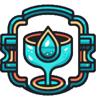
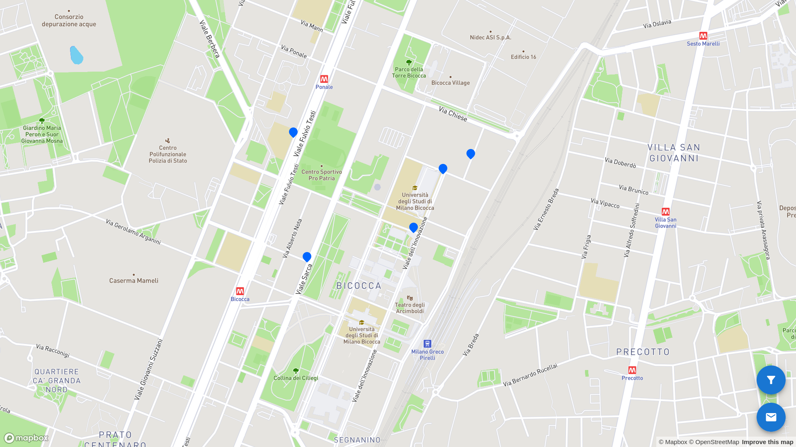
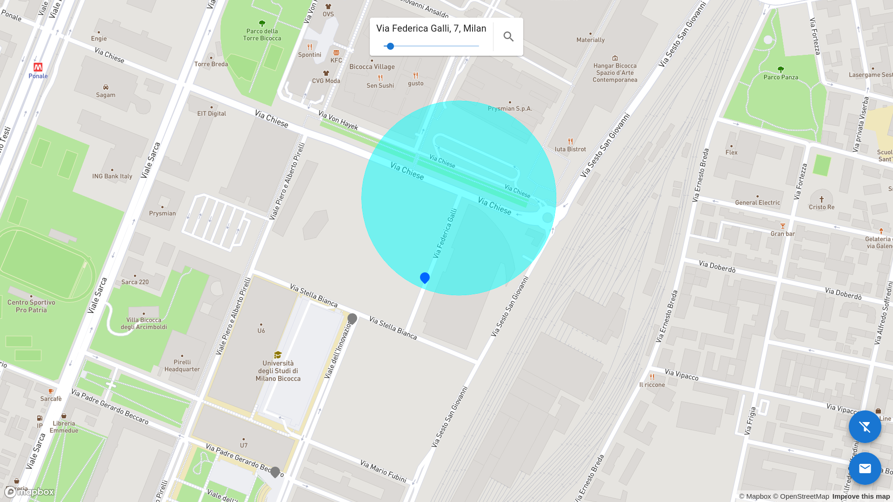
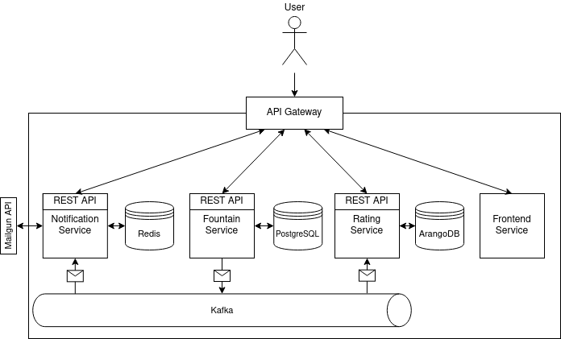

= Tre Acque

ifdef::env-github[]
++++

  

++++
endif::[]

ifndef::env-github[]

endif::[]

== What is Tre Acque?

Tre Acque is a crowd-sourced public application about drinking fountains located
on the national territory. The application allows users to add or remove a
fountain with a name, search fountains in a selected map area, give a vote in a
five star-based scale, see the average rating, and keep updated via email for
added or removed fountains.

This application was developed as final project for the Cloud Computing course
2022/2023 year, in the Computer Science master degree of University of
Milano-Bicocca, by:

- Vincenzo Corso (v.corso3@campus.unimib.it)

- Emanuele Petriglia (e.petriglia@campus.unimib.it)

- Gabriele Chiodi (g.chiodi5@campus.unimib.it)

The problem statement required us to develop a microservice application with at
least three services (with one external service call) and two databases. The
application had to implement at least one microservice patterns and had to be
deployed on a VM using Kubernetes. You can find the full requirements in
xref:doc/requirements.pdf[`doc/requirements.pdf`] file.

The project source code (git repository), artifacts and pipeline is hosted on
the public GitLab instance at https://gitlab.com/tre-acque/tre-acque.

== Screenshot

== Architecture Overview

ifdef::env-github[]
++++

  

++++
endif::[]

ifndef::env-github[]

endif::[]

At high level the architecture is composed of four services (fountain,
notification, rating, frontend). The user interacts with the system only through
the API Gateway. The backend services exchange messages using Kafka as message
broker.

=== Foutain Service

Is written in Java, using the Quarkus framework. Has three main
responsibilities: adding, deleting and searching fountains (also in a certain
area). Data are persisted in a PostgreSQL instance with a PostGIS extension
installed to support geoqueries. When a new fountain is added or deleted, an
event is sent to Kafka.

=== Rating Service

Is written in Go. Has two main responsibilities: saving a user rating and
calculating the average rating of a fountain. Data are persisted in an ArangoDB
instance. Each document represents a fountain and collects its ratings. When a
new fountain is added or deleted, the corresponding event is received and
processed.

=== Notification Service

Is written in Javascript, using NodeJS. Has two main responsibilities:
subscribing/unsubscribing users to fountain events and sending emails through an
external service (Mailgun). For the purpose of this demo, emails can be sent
only to authorized recipients (i.e. the team members). Data are saved in a
persistent Redis instance (AOF strategy). In particular there are two sets (one
for each event) containing the user emails. When a new fountain is added or
deleted, the corresponding event is received and processed.

=== Kafka

We chose Kafka as message broker because supports event replay (a must-have
feature for microservices) and gives guarantees about message ordering (ensure
data consistency). From version 2.8 there is the intent to replace Zookeeper
with a consensus protocol called KRaft. From version 3.3 this mode is now
production-ready. We used the KRaft mode (i.e. without zookeeper) to make it
easier deploying Kafka.

=== Frontend Service

This service returns a static HTML page containing the frontend app that runs on
the client browser. The app delivered is written with React. To show the map we
used another external service called Mapbox.

=== Microservice Patterns

In summary:

- each service uses its own db (*Database-per-service Pattern*).
- the fountain service notifies other services sending an event
through the message broker (*Messaging Pattern*).
- Users have a single point of access (*API Gateway Pattern*).

In addition:

- backend services offers three endpoints to verify if the instance is
started, ready and live (*Health Check Pattern*).
- fountain service uses quarkus extensions to avoid reinventing the
wheel and to simplify handling of the cross-cutting concern such as
health checking and messaging (*Microservices Chassis Pattern*).

== Try It

To quickly start the application you can use Docker Compose.

Follow these steps:

- Register to https://www.mapbox.com/[Mapbox] and
  https://www.mailgun.com/[Mailgun]. Get the api keys;
- Replace the api keys in docker-compose.yaml (`MAPBOX_TOKEN`, `MAILGUN_DOMAIN`,
  `MAILGUN_API_KEY`);
- From the root folder: `docker compose up --build`.

Now wait for the application to start and then go to http://localhost:80

If you want to deploy the application on minikube, you can use Skaffold. Follow these steps:

- Edit `k8s/dev/frontend.yaml` and `k8s/dev/mailgun.yaml`, replacing the dummy
  values with the api keys (encoded in base64);
- From the root folder: `skaffold dev`.

== How we deployed the application in production?

Well, this is an interesting question. You can find the details in
xref:doc/report.pdf[`doc/report.pdf`] and
xref:doc/deploy.adoc[`doc/deploy.adoc`] files.

== License

The project is licensed under the GNU Affero General Public License version 3
(GNU AGPL). See xref:LICENSE[`LICENSE`] file for more information.
